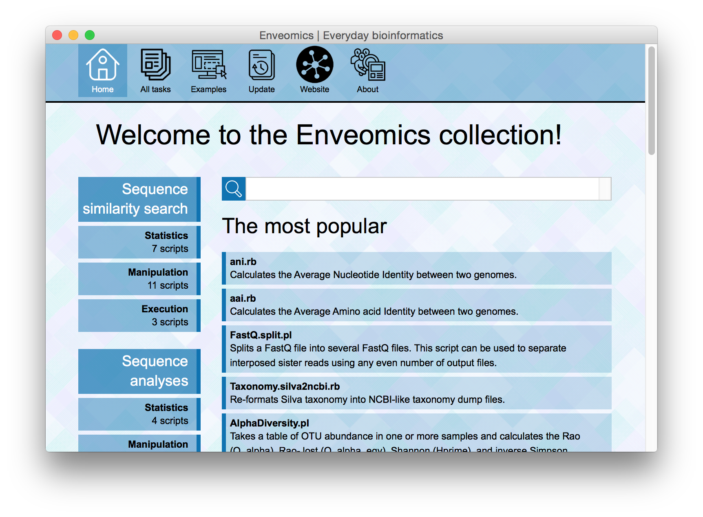
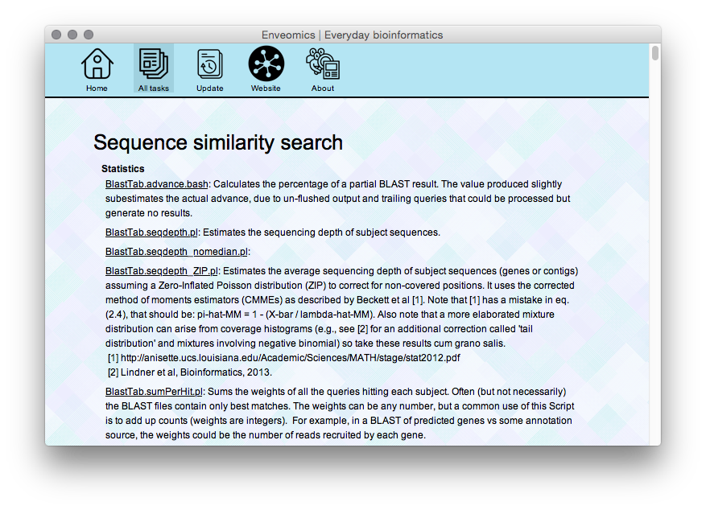
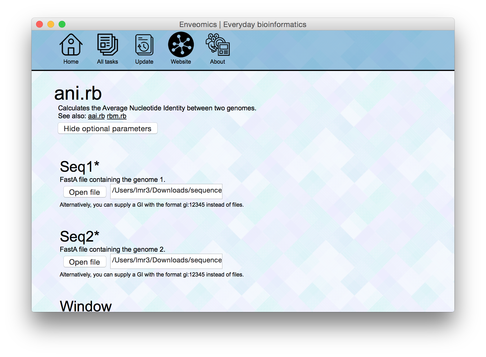
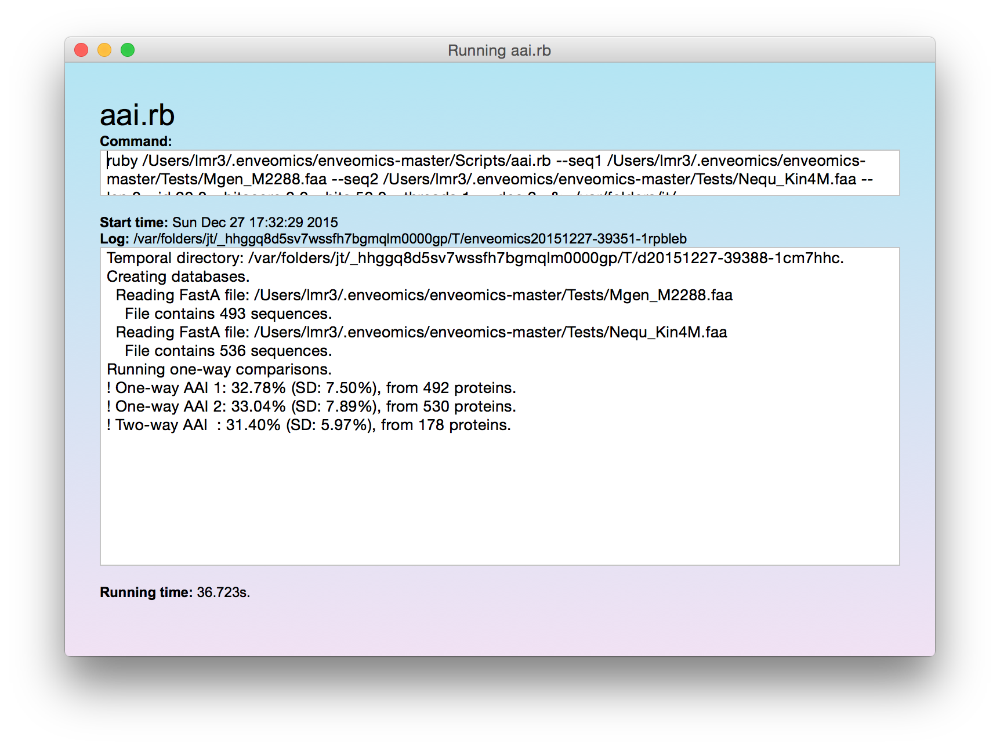

Enveomics GUI
=============

Graphical User Interface for [Enveomics][enve].

What can I do with this?
========================
You can run any of the many scripts in [Enveomics][enve] without ever opening
the terminal (you don't even need to know what the terminal is!). The scripts
in [Enveomics][enve] are specialized tasks for genomics and metagenomics
analyses. Some popular examples include scripts to estimate average sequence
identities between genomes ([ani.rb][anirb] and [aai.rb][aairb]),
alpha-diversity estimators from profiles or OTU tables ([AlphaDiversity.pl][1]
and [Chao1.pl][2]), and utilities to split sequence files ([FastQ.split.pl][3]
and [FastA.split.pl][4]). And there is much much more!

Features
========
* Executes scripts easily, no programming experience necessary.
* Reports the exact command executed so you can easily log, reproduce, automate,
  and report analyses.
* Detached execution, so you can run multiple analyses at the same time.
* Self-updating, so you always get the latest version of our scripts.
* Zero configuration, just download and open.
* All the magic of [Shoes][shoes].

Show me, please!
================
My pleasure. Here's the home window:

Here, the complete index of tasks:

This is us preparing to calculate the Average Amino acid Identity (AAI) between
two genomes:

And the result window:

Install
=======
Prerequisites
-------------
You'll only need a [Java Virtual Machine][5] to open the GUI. However, you
might need other Software installed in your computer to execute certain scripts.
Notably, you'll need [Perl][6] to execute any of the tasks ending in `.pl` and
[Ruby][7] to execute any of the tasks ending in `.rb`. Also, the few tasks
ending in `.bash` will require a GNU Bash port in Windows machines, and some
tasks have additional requirements that are unlikely to ever work in Windows.
That said, we're trying to extend our support as wide as possible, so please
[report any issues][issues].

Linux or BSD
------------
1. Download [enveomics.jar][jar].
2. Make sure you have [Java][5] or another implementation like [OpenJDK][8],
   and use it to open `enveomics.jar`. In most modern Linux distros you can
   simply right-click on the file and select to open with JVM or OpenJDK, or
   even just double-click the file. If it doesn't work please
   [let us know][issues], and execute this in the terminal:
   `java -jar enveomics.jar`, changing the path of `enveomics.jar` to wherever
   you downloaded it.

Mac OS X
--------
1. Download and open [enveomics.dmg][dmg].
2. Drag `enveomics.app` to the `Applications` folder.

Windows
-------
Our current pre-release is yet to be tested in Windows. If you're not affraid of
bugs, just follow the same instructions above for Linux or BSD. And whatever
happens, please [let us know][issues].

From the source
---------------
If you want to play with the code of Enveomics GUI, you can open it directly
from the source. Check out [INSTALL-HARD.md](INSTALL-HARD.md) to learn how.

Coming soon
===========
* Support for `enveomics.R`.
* Input multiple files for scripts supporting them.
* Easy installation, so terminal use is eliminated.

Credits
=======
The Enveomics GUI was developed on [Shoes 4][shoes] by
[Luis M. Rodriguez-R][lrr]. For additional information on the scripts
collection, please refer to [Enveomics][lrr]. Icons by
[Yu Luck from the Noun Project][yuluck].

License
=======
Enveomics GUI and the [Enveomics collection][lrr] are licensed under the terms
of [The Artistic License 2.0](LICENSE), except when otherwise noted.

[issues]: https://github.com/lmrodriguezr/enveomics-gui/issues
[jar]: http://enve-omics.ce.gatech.edu/data/public_enveomics/enveomics.jar
[dmg]: http://enve-omics.ce.gatech.edu/data/public_enveomics/enveomics.dmg
[lrr]: http://lmrodriguezr.github.io/
[enve]: https://github.com/lmrodriguezr/enveomics  "Enveomics collection"
[anirb]: http://enveomics.blogspot.com/2013/10/anirb.html
[aairb]: http://enveomics.blogspot.com/2013/10/aairb.html
[shoes]: https://github.com/shoes/shoes4 "Shoes 4"
[yuluck]: https://thenounproject.com/yuluck
[1]: http://enveomics.blogspot.com/2013/08/alphadiversitypl.html
[2]: http://enveomics.blogspot.com/2012/11/scripts-chao1pl.html
[3]: http://enveomics.blogspot.com/2012/11/fastasplitpl.html
[4]: http://enveomics.blogspot.com/2013/09/fastqsplitpl.html
[5]: https://www.java.com/en/download/
[6]: https://www.perl.org/get.html
[7]: https://www.ruby-lang.org/en/documentation/installation/
[8]: http://openjdk.java.net/
